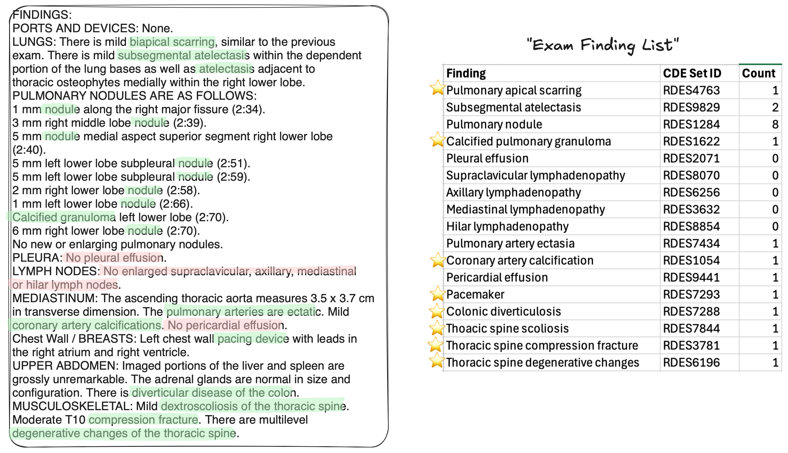
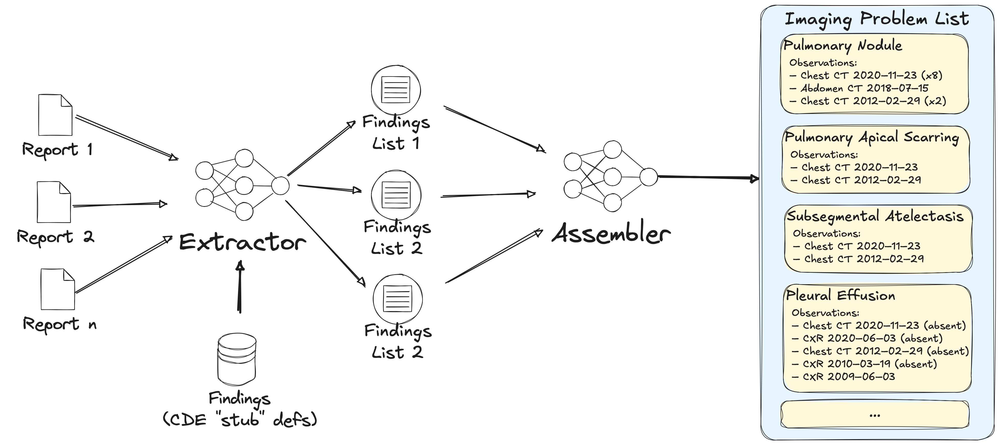

# Imaging Problem List

The imaging problem list is a structured representation of a patient’s imaging findings organized by type of finding along with references to where it’s been seen in the patient’s imaging exams.
The key data structures are the Exam Finding List (for inidividual reports) and the Imaging Problems list (for the patient's entire history)

## Exam Finding List (EFL)

In the context of an imaging exam, a list of the findings declared as present/absent on that exam.

- Must also have basic information (keyed by a curated list of LOINC codes) about what exam this is
- The same finding type may be declared are present multiple times; each time is a separate entry in the EFL
- FHIR representation: **DiagnosticReport** containing a list of **Observation** objects, with a finding code on each Observation and a list of components with attribute codes and values (especially present/absent and change from prior)
- Can be generated by LLM from an existing report or generated live during exam time; each Observation should include some kind of provenance marker

## Imaging Problem List (IFL)

In the context of a patient, the list of findings that have been described as present/absent in exams of the patient.

- Each finding also has references to the time course of being seen on imaging exams
- FHIR representation: **Report** containing a list of **Condition** objects (labeled with the finding identifier), where each Condition object also contains a list of **Observation** objects which document which exams (**DiagnosticReports**) the  finding type has been documented on, including the exam date and exam type (LOINC type)
