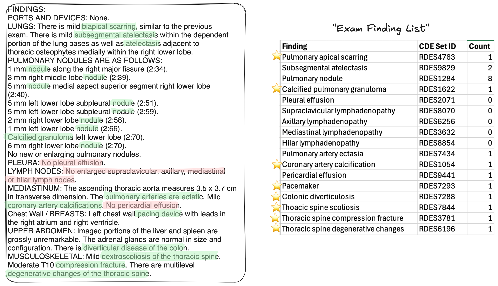
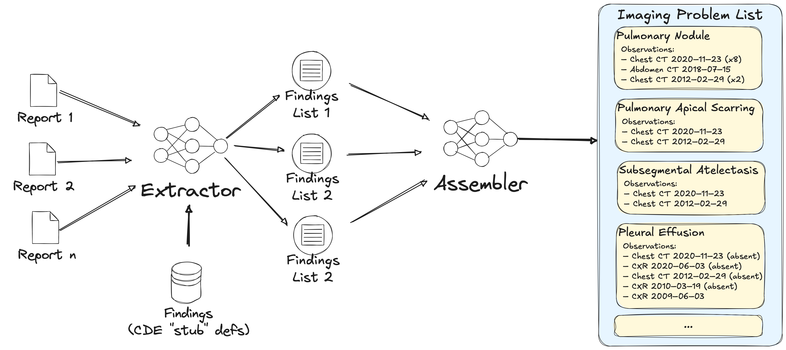

# Imaging Problem List

The imaging problem list is a structured representation of a patient’s imaging findings organized by type of finding along with references to where it’s been seen in the patient’s imaging exams.
The key data structures are the Exam Finding List (for inidividual reports) and the Imaging Problems list (for the patient's entire history)

## Finding Extraction

Extract structured findings from radiology reports using LLM agents across cloud, local, and on-prem providers:
- **OpenAI** (current reasoning-capable models)
- **Anthropic** (Claude 4.x, extended thinking)
- **Google** (Gemini 3.x, thinking levels)
- **OpenRouter** (aggregates many providers with unified API)
- **Ollama** (local models, no API key needed)
- **vLLM** (OpenAI-compatible deployments)

Quick start:
```bash
uv run finding-extractor report.txt
uv run finding-extractor report.txt -m anthropic:claude-sonnet-4-5 --reasoning high
uv run finding-extractor report.txt -m vllm:google/gemma-4-31B-it --reasoning none
```

See `docs/extraction-usage.md` for provider setup and reasoning configuration.


## Exam Finding List (EFL)

In the context of an imaging exam, a list of the findings declared as present/absent on that exam.



- Must also have basic information (keyed by a curated list of LOINC codes) about what exam this is
- The same finding type may be declared are present multiple times; each time is a separate entry in the EFL
- FHIR representation: **DiagnosticReport** containing a list of **Observation** objects, with a finding code on each Observation and a list of components with attribute codes and values (especially present/absent and change from prior)
- Can be generated by LLM from an existing report or generated live during exam time; each Observation should include some kind of provenance marker

## Imaging Problem List (IPL)

In the context of a patient, the list of findings that have been described as present/absent in exams of the patient.



- Each finding also has references to the time course of being seen on imaging exams
- FHIR representation: **Report** containing a list of **Condition** objects (labeled with the finding identifier), where each Condition object also contains a list of **Observation** objects which document which exams (**DiagnosticReports**) the  finding type has been documented on, including the exam date and exam type (LOINC type)

## Extraction Persistence (SQLite via SQLModel)

The project includes an async persistence layer and optional CLI persistence writes.

- Reports are deduplicated by SHA-256 hash of report text (`reports` table)
- Each extraction run is stored as its own object with:
  - report link
  - extraction timestamp
  - model used
  - reasoning setting
  - full JSON payload
- Findings and non-finding text are stored as nested JSON in `extractions.extraction_json`
- User edits are represented as correction objects (`corrections`) so reviewers can:
  - propose a new finding (`add_finding`)
  - suggest updates to an existing finding (targeting by finding index/JSON path) (`update_finding`)
  - leave comments for follow-up (`comment`)

Persistence documentation:
- Usage guide: `docs/persistence-usage.md`
- Internals guide: `docs/persistence-internals.md`
- CLI persistence notes/future enhancements (archived): `docs/archive/persistence-cli-plan.md`

API server documentation:
- API usage: `docs/api-usage.md`
- API internals: `docs/api-internals.md`
- Configuration reference: `docs/configuration.md`
- Logging usage: `docs/logging-usage.md`
- Logging internals: `docs/logging-internals.md`
- Testing practices (project-specific): `docs/testing-practices.md`
- Local runtime/devops runbook: `docs/dev-ops.md`
- Schema migration runbook: `docs/schema-migrations.md`

## Developer Workflows

This repo uses `Taskfile.yml` as the command surface for backend workflows.

Common commands:

```bash
task setup
task lint
task format:web
task test              # Unit tests (excludes UI/integration)
task test:ui           # Playwright UI tests (run separately)
task test:api:e2e      # Backend API E2E against running backend stack
task test:web:e2e      # Full extractor UI E2E (requires Docker + API keys)
task extract:example3
task db:migrate
task db:migrate:stack
task db:migrate:auto:stack
task db:stamp:baseline
task db:stamp:baseline:stack
task db:check
task stack:up
task stack:down
```

Compatibility aliases:

```bash
task test:smoke
task test:integration
```

`task stack:up` and `task stack:up:full` now run migration preflight automatically (`task db:migrate:auto:stack`) before starting API/worker services.

Batch extraction CLI (local in-process, interactive/detached):

```bash
uv run --env-file .env finding-extractor-batch run sample_data/example3 --glob "*.txt" --mode interactive --allow-slow
uv run finding-extractor-batch status --run-id <run_id> --watch
```

For intentionally long batch runs, pass `--allow-slow` (runtime preflight guard override).

Coding CLI (run the production post-extraction coding pipeline on saved extraction JSON):

```bash
uv run --env-file .env finding-extractor-code extraction.json
uv run --env-file .env finding-extractor-code extraction.json --output coded.json
```

Evaluation harness (measure extraction quality):

```bash
task eval:smoke                          # Run smoke dataset with defaults
finding-extractor-eval run --dataset smoke --model openai:gpt-5-mini --threshold-f1 0.5
```

See:
- `docs/extraction-usage.md`
- `docs/human-review-workflow.md`
- `docs/eval-usage.md`
- `docs/eval-internals.md`
- `docs/coding-agent-design.md`
