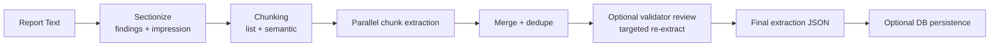

# Finding Extractor Usage

Extract structured findings from radiology reports using an LLM agent.

## How Extraction Works (High-Level)

At runtime, the extractor uses one shared orchestration path across CLI, API worker jobs, batch runs, and evals.

1. Parse report sections deterministically.
2. Keep extraction scope to `findings` and `impression`.
3. Chunk those sections (impression list-aware, semantic grouping for longer text).
4. Run chunk extraction sub-agents in parallel (dedicated chunk prompt + `ExtractedChunkFindings` schema).
5. Merge + dedupe findings, optionally run targeted re-extraction review, then finalize output.
6. Emit status stages throughout; return JSON and optionally persist to SQLite.



For implementation-level details and full stage contracts, see `docs/extraction-internals.md`.

## Quick Start

```bash
uv run finding-extractor report.txt
```

Output is JSON with extracted findings, locations, attributes, and non-finding text segments.

Note: Coding (OIFM finding code and location code assignment) is a separate, independent step — see `docs/coding-agent-design.md`.

## Choosing a Model

Pass any [pydantic-ai model string](https://ai.pydantic.dev/models/) via `--model` or the `IPL_MODEL` env var.

| Provider | Example `--model` value | API key env var |
|----------|------------------------|-----------------|
| OpenAI | `openai:gpt-5.2` (fallback default) | `OPENAI_API_KEY` |
| Anthropic | `anthropic:claude-opus-4-6` | `ANTHROPIC_API_KEY` |
| Google | `google-gla:gemini-3-flash-preview` (default) | `GOOGLE_API_KEY` |
| OpenRouter | `openrouter:meta-llama/llama-3.1-70b` | `OPENROUTER_API_KEY` |
| Ollama | `ollama:qwen3:30b-instruct` | *(none, local)* |

```bash
# Anthropic
uv run finding-extractor report.txt -m anthropic:claude-opus-4-6

# Google
uv run finding-extractor report.txt -m google-gla:gemini-3-flash-preview
uv run finding-extractor report.txt -m google-gla:gemini-3.1-pro-preview

# OpenRouter (aggregates many providers)
uv run finding-extractor report.txt -m openrouter:meta-llama/llama-3.1-70b

# Local Ollama (see Ollama setup below)
uv run finding-extractor report.txt -m ollama:gpt-oss:20b
uv run finding-extractor report.txt -m ollama:gpt-oss:120b --reasoning medium
uv run finding-extractor report.txt -m ollama:gemma4-radextract
```

### Ollama Setup

Ollama runs models locally without API keys. You must:

1. **Install and start Ollama:** Follow [ollama.com](https://ollama.com)
2. **Pull model(s):**
   - `ollama pull gpt-oss:120b` — fast (MXFP4), recommended
   - `ollama pull gpt-oss:20b` — fast, lightweight
   - `ollama pull gemma4:26b` — for custom Modelfile builds (see `ollama/README.md`)
   - `ollama pull nemotron-3-super:120b` — MoE, good quality
   - `ollama pull qwen3.5:27b` — general-purpose
3. **Set base URL:** Add `OLLAMA_BASE_URL=http://localhost:11434/v1` to your `.env`
4. **For multi-model runs** (extraction + reviewer): `export OLLAMA_MAX_LOADED_MODELS=4`

See `config.toml.example` for recommended local Ollama settings (timeout, concurrency, model selection).

```bash
# Add to .env:
OLLAMA_BASE_URL=http://localhost:11434/v1

uv run finding-extractor report.txt -m ollama:gpt-oss:20b
```

#### NativeOutput for models without tool support

Some Ollama model families (gemma4 MoE, gemma3, deepseek-r1, MedGemma) don't support PydanticAI's tool-calling protocol. The extractor automatically detects these and uses PydanticAI's `NativeOutput` (JSON schema mode) instead. No manual configuration needed.

#### Custom Modelfiles

For models that benefit from conservative decoding (low temperature, fixed seed), custom Modelfiles are available in `ollama/`. See `ollama/README.md` for build instructions.

## Reasoning / Thinking Level

The `--reasoning` flag controls how much "thinking" the model does before responding. Higher levels improve extraction quality at the cost of latency and tokens.

```bash
uv run finding-extractor report.txt --reasoning high
uv run finding-extractor report.txt --reasoning none
```

Levels: `none`, `minimal`, `low`, `medium`, `high`

Reasoning defaults are provider-specific (`openai=medium`, `anthropic=medium`, `google=low`, `openrouter=medium`, `ollama=none`). You can override with `--reasoning` or `IPL_REASONING`.

For Ollama, reasoning is model-specific:
- `ollama:gpt-oss:120b`: `none|low|medium|high` (`minimal` normalizes to `low`)
- `ollama:qwen3.5:27b`: `none` (default)
- `ollama:nemotron-3-super:120b`: `none` (default)
- `ollama:qwen3:30b-thinking`: `none|minimal|low|medium|high` (mapped to `think=false|true`)
- `ollama:qwen3:30b-instruct`: `none` only

Configuration details (env vars, `config.toml`, precedence, and secrets policy):
- `docs/configuration.md`

## All CLI Options

```
finding-extractor <report_file> [OPTIONS]

Options:
  --exam-type TEXT          Exam description for context (e.g., "CT Chest")
  --output, -o PATH         Write JSON to file (combine with -f table to also show summary)
  --model, -m TEXT          Model override (default: IPL_MODEL env var)
  --reasoning, -r LEVEL     none | minimal | low | medium | high
  --format, -f FORMAT       json (default) | table
  --validate / --no-validate  Run post-extraction coverage analysis (default: --validate)
  --store / --no-store      Persist to SQLite (default: --no-store)
  --db-path PATH            SQLite path (default: IPL_DB_PATH or .finding_extractor.db)
  --logfire / --no-logfire  Enable or disable Logfire observability for this run
  --verbose                 Emit INFO-level logs for this run
```

### `--validate` semantics (enabled by default)

Validation is enabled by default. Use `--no-validate` to disable it.

`--validate` runs a **coverage analysis** that checks whether all report text lines are accounted for by extracted findings or non-finding text segments. It does **not** perform verbatim quote checking — that is handled automatically by the agent's output validator, which retries the model when quotes don't match. As a result, `--validate` always returns `is_valid=True` with no `verbatim_errors`; it only produces `coverage_warnings`.

## Logfire Observability

Logfire is optional and disabled by default.

```bash
# Enable globally for API/worker/CLI runs via env
export IPL_LOGFIRE_ENABLED=true

# Enable only for one CLI invocation
uv run finding-extractor report.txt --logfire
```

For complete Logfire env options and defaults, see `docs/configuration.md`.

Supported instrumentation in this project includes:
- `pydantic_ai` agent runs
- `httpx` model/provider HTTP calls
- FastAPI request handling
- SQLAlchemy database operations
- Redis operations

## Logging Output Controls

Structured logging is configured via env vars:

```bash
export IPL_LOG_LEVEL=WARNING
export IPL_LOG_JSON=false
```

- `IPL_LOG_LEVEL`: `CRITICAL|ERROR|WARNING|INFO|DEBUG|NOTSET` (also accepts `WARN`)
- `finding-extractor --verbose ...`: one-run override to emit `INFO` logs.
- `IPL_LOG_JSON`: emit machine-readable JSON logs when `true`

## Python API

```python
from finding_extractor.extractor.runtime import run_extraction_runtime

result = await run_extraction_runtime(
    report_text="FINDINGS: Clear lungs. No pleural effusion.",
    study_description="Chest XR",
    model="anthropic:claude-sonnet-4-5",
    reasoning="high",
    validate=True,
    reliability_mode="strict",
    store=None,
    db_path=None,
    source_ref=None,
    report_id=None,
    # Optional: receive stage status messages during extraction
    # status_callback=async_fn_that_takes_a_string,
)

for finding in result.extraction.findings:
    print(f"{finding.finding_name}: {finding.presence}")
```

## Output Format

The JSON output contains:

- `exam_info` — study description, date, modality, body part
- `findings[]` — each with `finding_name`, `presence`, `location`, `attributes`, `report_text`, and optional `coding`
- `non_finding_text[]` — technique, indication, impression, etc.
- `findings[].coding.finding_code` — OIFM coding status (`coded|unmapped`), selected code, method, candidates
- `findings[].coding.location_code` — anatomic location coding status (`coded|unmapped`), selected code, method, candidates

Use `--format table` for a human-readable summary instead of JSON. Combine `-o output.json -f table` to write JSON to file and show the table summary on the terminal.

## Persistence

Use `--store` to persist reports/extractions to SQLite. See `docs/persistence-usage.md` for details.

## Batch Extraction CLI

For many reports at once, use `finding-extractor-batch` (local in-process runner).

Interactive mode:

```bash
uv run --env-file .env finding-extractor-batch run sample_data/example3 \
  --glob "*.txt" \
  --workers 4 \
  --model openai:gpt-5-mini \
  --reasoning medium \
  --validate \
  --resume \
  --mode interactive \
  --allow-slow
```

Detached mode:

```bash
uv run --env-file .env finding-extractor-batch run sample_data/example3 \
  --glob "*.txt" \
  --mode detached \
  --allow-slow
```

Watch detached status:

```bash
uv run finding-extractor-batch status --run-id <run_id> --watch
```

Configuration defaults for workers, timeouts, retries, run dir, and suffix can be set via:
- env vars (`IPL_BATCH_*`)
- `config.toml` (`[ipl]`)

Batch runs also use a runtime preflight guard:
- `--max-predicted-runtime-seconds` (default `900`)
- `--allow-slow` to explicitly override when long runs are intentional

Reference:
- `docs/configuration.md`
