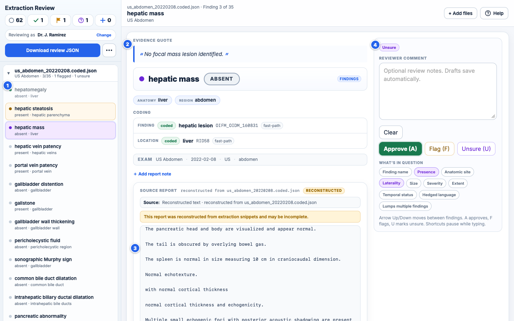
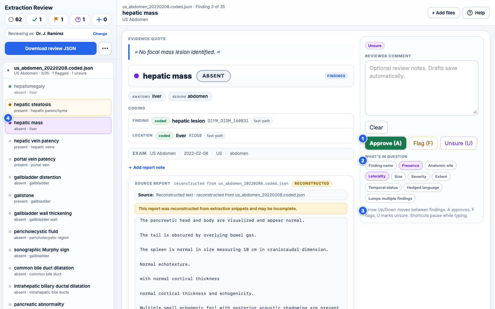
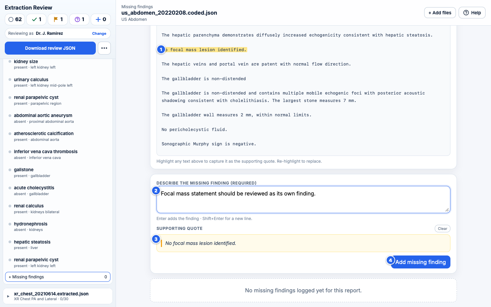

# Extraction Review — Quick Guide

This tool shows you, one finding at a time, what the AI pulled out of a radiology report. For each one you decide: **is this the right finding, said the right way, in the right place?** Approve the good ones, flag the bad ones with a short note, and log anything the extractor missed.

Nothing leaves your machine. Your progress auto-saves as you go. When you're done, the tool produces one combined review JSON for you to send back.

For the usual CSV workflow, select the source CSV, select the extraction-results folder, and check the matched/unmatched/invalid counts before choosing **Start review**. A green quote spot-check confirms that the displayed report text supports at least one extraction quote. If you loaded files directly, re-pick the same files or folder after reopening the page to restore that saved review.

---

## The screen at a glance

The middle pane is organised top-down so each section answers the next question a reviewer asks:

1. **Evidence quote.** The exact phrase the extractor used as evidence. If it doesn't support the extraction, flag it.
2. **Finding + presence.** The extracted finding name in bold next to a colour-coded badge: green `PRESENT`, gray `ABSENT`, amber `POSSIBLE`. The badge is the single most important thing to double-check.
3. **Location.** Compact chips for specific anatomy, body region, and laterality — subordinate to the finding name.
4. **Attributes.** Size, morphology, flow direction, etc. Sanity-check these against the quote above.
5. **Source report.** The full resolved report, with the current evidence quote highlighted and scrolled into view. A warning appears if the quote cannot be matched or the report had to be reconstructed.
6. **Your review panel.** Status chip, comment box (drafts auto-save), **Clear** / **Approve** / **Flag** / **Unsure** buttons, optional “What's in question” chips, and a keyboard hint.
7. **Worklist.** Every finding from every file you loaded, grouped by file, only the active file expanded. Click any row to jump.
8. **Toolbar actions.** **+ Add files** to load more extractions without leaving your progress, and **Help** to reopen this guide.

(Not labeled: below the attributes you'll also see **Coding** — OIFM/RID codes with a confidence status — and a thin **Exam** metadata strip. Expand **Report context** at the bottom if you want surrounding paragraphs.)

---

## Reviewing a finding

The whole loop is designed to be keyboard-first so you can rip through a worklist. The three main actions:

- **Approve** — you agree: the finding exists in the report, the presence is right, the location makes sense. No comment required.
- **Flag** — something is wrong: the finding isn't there, the presence is wrong, the location is wrong, the quote doesn't support the claim, etc.
- **Unsure** — you cannot confidently approve or reject the finding from the report.
- **Draft comment** — typing in the comment box without flagging leaves a blue draft indicator in the sidebar. Useful if you want to come back and think more.

Flag and Unsure reveal optional **What's in question** chips. Use them to identify the doubtful part: finding name, presence, anatomic site, laterality, size, severity, extent, temporal status, hedged language, or a finding that lumps multiple findings together. Comments and chips are helpful but not required.

Approve, Flag, and Unsure auto-advance to the next **pending** finding, skipping over ones you've already touched.

### Keyboard shortcuts

These work any time you're not inside the comment box. They're the fast path.

| Key                         | Action                                                                     |
| --------------------------- | -------------------------------------------------------------------------- |
| <kbd>A</kbd>                         | **Approve** current finding, jump to next pending |
| <kbd>F</kbd>                         | **Flag** current finding, jump to next pending    |
| <kbd>U</kbd>                         | Mark current finding **Unsure**, jump to next     |
| <kbd>↑</kbd> / <kbd>↓</kbd>          | Previous / next finding                              |
| <kbd>?</kbd>                         | Open this guide                                      |

Inside the comment box:

| Key                               | Action                                                    |
| --------------------------------- | --------------------------------------------------------- |
| <kbd>Enter</kbd>                  | Submit the flag (only if there's a comment)               |
| <kbd>Shift</kbd>+<kbd>Enter</kbd> | New line in the comment                                   |
| <kbd>Esc</kbd>                    | Blur the comment box (so you can use the shortcuts above) |

All shortcuts pause while you are typing in any input or textarea. A typical rhythm is **A, A, F, U, A, …**; add comments or question chips when they clarify the verdict.

### Status indicators in the sidebar

A dot on each row tells you its review state at a glance:

1. **Approved** — green dot, row dimmed. Already reviewed, moving on.
2. **Approved and currently selected** — green dot + blue outline. This is what's in the main pane.
3. **Flagged** — amber dot and row treatment.
4. **Unsure** — purple question-mark state.
5. **Draft comment** — blue dot. You typed something but didn't set a verdict; it's saved and waiting.
6. **Pending** — gray dot. Not yet touched.
7. **Tally pills** at the top show pending, approved, flagged, unsure, and missed counts across all loaded files.
8. **Download review JSON** — the primary export button. Enabled after you enter a reviewer identifier; untouched findings are exported as pending. The arrow menu contains the per-report zip compatibility export.

---

## Flagging a finding — what to write

Be specific about **why** the extraction is wrong. A good comment points the extractor team at the fix. A few patterns that help:

- _"Report doesn't actually say this — the quote is from a different paragraph."_
- _"Presence is wrong — report says 'no discrete mass', should be absent not present."_
- _"Wrong laterality — report says right kidney, extraction says left."_
- _"Location is too broad — should be 'mid pole' not just 'kidney'."_
- _"Coded to wrong concept — this is fatty infiltration, not hepatic parenchymal disease generally."_

A one-line reason is usually enough. Use the question chips when they communicate the issue more precisely. You can also leave a draft comment if you want to think about something and come back to it.

---

## Logging a finding the extractor _missed_

Every file has a **+ Missing findings** button at the bottom of its group in the sidebar. Click it and you get a dedicated panel:

### How to use it

1. **Highlight the phrase** in the source report that describes the missing finding. Your selection turns yellow and stays highlighted — so you can see exactly what you captured.
2. **Supporting quote** — the selection auto-populates this read-only card. Re-highlight anywhere in the report to replace; use **Clear** to remove.
3. **Description textarea** — focus jumps here automatically after you highlight. Describe the missing finding however feels natural: _"small left pleural effusion, not mentioned in the impression"_ is fine. <kbd>Enter</kbd> submits; <kbd>Shift</kbd>+<kbd>Enter</kbd> for a new line.
4. **Add missing finding** — saves the entry. It shows up in the list below the form, and the sidebar's **+ missed** counter ticks up.

You'll see added entries listed below the form. Each has a **Remove** button if you change your mind.

### About the source report

The source report is visible both while reviewing a finding and while logging a missing one. In CSV batches, staged `_staged_reports/*.txt` text is preferred because it is the text used for extraction. If staged text is unavailable, the normalized CSV report is used. Direct loads use paired `.txt`/`.md` or embedded report text when available.

If only the extraction JSON was shipped, the tool **reconstructs** a rough report from the extracted snippets — you'll see an orange **RECONSTRUCTED** pill. It's usable for orientation and highlight-to-quote, but it isn't the full original text, so treat it as a prompt rather than a transcript.

---

## Finishing up

1. Make sure your name or identifier is in the **reviewer identifier** field (top of sidebar). This stamps every output file.
2. Click **Download review JSON**. It records every report and finding, including pending findings, report notes, missing findings, unsure verdicts, and question chips.
3. Send that JSON back to whoever asked you to review. The dropdown's per-report zip is available only for older workflows that require it.

You don't need to finish in one sitting. CSV batches and embedded bundles can be resumed from the saved-batch prompt; after a direct load, re-pick the same files or folder to restore it. Saved work belongs to this browser/profile and this HTML location. Browsers vary in how they scope `file://` storage, and may evict it under disk pressure, so download the combined JSON periodically and before moving the HTML or switching browsers.
